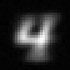
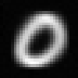

# reverse-mnist
Simple deconvolution example to re-generate mnist digits

Associate a one-hot vector representing a digit to the corresponding
image:

`[0, 0, 0, 0, 1.0, 0, 0, 0, 0, 0]`
to

The network is trained on the reverse mnist dataset (labels to images)
and the L2 loss function trains the output to look like the average of
the corresponding training images.

Here's an animation created by blending digits from 0 to 9 using
this network:

